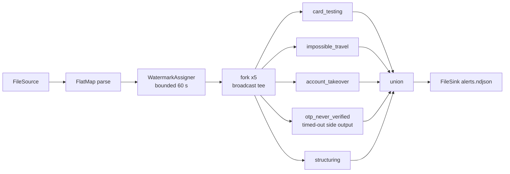

# card-sentry

Card-fraud detection built on [clink](https://github.com/orhaugh/clink)'s
CEP engine. One deterministic synthetic tape of card payments and account
activity with labelled fraud campaigns injected, five detectors written
against the native `clink::cep` pattern DSL, and an oracle that gates the
run exactly: every expected alert fired, every negative control stayed
quiet, zero false positives.

Where [market-pulse](https://github.com/orhaugh/market-pulse) is analytics
on a tape (windows, joins, aggregations), card-sentry is detection and
response: sequences, absences, timeouts and dynamic response over the same
engine. It is a downstream consumer, not part of clink - it installs clink
into a local prefix and builds against the installed CMake package the way
any project would - and it doubles as an integration test of the engine
surface it exercises. Its first run found a real CEP correctness defect
(below), which was fixed in clink before this repository's first commit.

**Status: round 1.** Embedded detection over the tape, oracle-gated, with
per-pattern harness tests. The detectors currently require clink `main`
(they depend on a CEP fix newer than v0.4.0), so install with
`CLINK_SOURCE` pointing at a clink checkout; the pin flips to the next
release when it exists. Planned rounds: dynamic rules over broadcast state,
live risk lookup through queryable state, exactly-once alert delivery to
Postgres (kill the detector mid-run, the case table stays exact), cluster
deployment as a compiled job plugin, savepoint schema evolution, and
incident replay with `--emit-test`.

## Quick start

```bash
# 1. Install clink into .clink/prefix (from a local checkout, until the
#    next release ships the CEP fix; afterwards just scripts/get-clink.sh)
CLINK_SOURCE=~/personal/clink scripts/get-clink.sh

# 2. Generate the tape, build, test, detect, verify - one gate
scripts/run-detections.sh
```

The final line of a good run is the oracle's verdict:

```
OK: every expected alert fired, every control stayed quiet, zero false positives.
```

## The tape

`tools/csgen.py` (seed 7 by default) writes `data/events.ndjson`: three
days of card authorisations, logins, OTP request/verify pairs, password
changes and transfers for a small fleet, in ARRIVAL order. Event time and
arrival order disagree - most events land within 3 seconds of their
timestamp, some up to 40 seconds late - so correct detection needs
event-time watermarks, not file order.

Thirteen campaigns are injected on dedicated entities and recorded in
`data/manifest.json`: nine that must alert, and four negative controls -
sequences engineered to look close to fraud that must NOT alert (a verified
account recovery, a plausible-speed travel pair, an OTP verified near the
window's edge, two band transfers that never reach the structuring
threshold). Noise is generated under invariants that keep it provably
clear of every decision boundary (documented in the generator), so any
alert outside the manifest is a detector or engine bug, and the checker
fails the run.

## The five detectors

Each detector exercises a distinct part of the pattern DSL
(`app/src/patterns.hpp`):

| Pattern | Fraud story | DSL surface it exercises |
|---|---|---|
| `card_testing` | Burst of small declined auths validating a stolen number, then one large approved strike | `.times(4, 20)` quantifier; iterative strike predicate sized against the captured probes; `skip_past_last_event` collapsing suffix partials |
| `impossible_travel` | Two card-present auths at a speed no traveller reaches | Iterative predicate reading the anchor event from the partial match (great-circle distance over elapsed event time) |
| `account_takeover` | Failed logins, password change, draining transfer, and never an OTP verify in between | Two `not_followed_by` negative zones inside one sequence |
| `otp_never_verified` | OTP requested, verification never arrives | The pattern describes the HEALTHY flow; the alert is the **timed-out side output** - the partial that never completed |
| `structuring` | Transfers just under a reporting threshold whose running total crosses the trip line | Complementary iterative predicates: the quantified step captures while the sum stays below the threshold, the tip step takes exactly the transfer that crosses it, so the greedy quantifier can never swallow the trip |

All five run in one embedded pipeline (`app/src/card_sentry.cpp`):



Branch threads interleave, so the alert file's order varies run to run;
the alert SET is deterministic, and the checker compares sets.

## Verification

Three independent gates, all run by `scripts/run-detections.sh`:

1. **Harness tests** (`app/tests/patterns_test.cpp`): each detector driven
   through clink's public testing framework with explicit event times and
   watermarks - match, non-match, negation, timeout and skip behaviour
   pinned per pattern, plus a codec round-trip.
2. **The oracle** (`tools/check.py`): the tape run's alerts against the
   manifest - exact multiset equality on the expected alerts, silence from
   every negative control, and zero alerts anywhere else.
3. **Determinism**: same tape, same alert set, every run.

## What the first round found in the engine

Building this repository surfaced two engine-level findings on day one -
the point of a consumer showcase that doubles as an integration test:

1. **`within()` was not enforced at match time.** A pattern's completing
   event arriving *between watermarks* could produce a match whose
   event-time span exceeded `within()` - the bound was only applied by
   watermark-driven eviction. Found by this repo's OTP harness test (a
   verify arriving 40 minutes after its request completed a 5-minute
   pattern "healthily"), fixed in clink `main` with regression tests, in
   the operator and both contract comments.
2. **CEP matches in arrival order, and that contract matters.** The
   matcher does not buffer and re-sort by event time, so a stream whose
   arrival skew can invert a pattern's steps needs gaps wider than the
   skew (what this tape's noise now guarantees) or a reordering stage
   upstream (a candidate engine feature). The contract is now stated
   explicitly in clink's CEP documentation.

## Layout

```
scripts/get-clink.sh        install clink (release tag, or CLINK_SOURCE=<checkout>)
scripts/run-detections.sh   generate -> build -> test -> detect -> verify
tools/csgen.py              deterministic tape + manifest generator
tools/check.py              the oracle
app/src/events.hpp          event model, parser, codec, haversine, alerts
app/src/patterns.hpp        the five detectors
app/src/card_sentry.cpp     the embedded pipeline
app/tests/patterns_test.cpp harness tests per pattern
```

## Pinning

`scripts/get-clink.sh` installs into `.clink/prefix`; nothing touches
system paths. Release mode clones a pinned tag (currently the v0.4.0
baseline) and `CLINK_SOURCE=/path/to/clink` installs a local working tree
into the identical layout - the consumption seam (installed package + CLI)
is the same in both modes, so flipping between them changes nothing in
this repository. The install stamp records the source commit and a
`-dirty` marker; a dirty tree always reinstalls.

## Licence

Apache-2.0.
