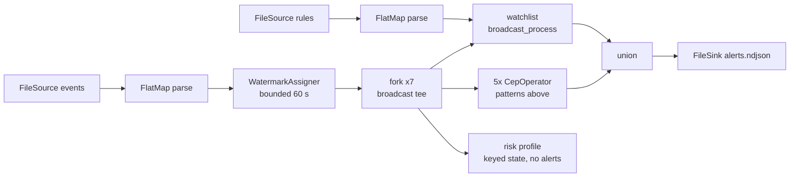

# card-sentry

Card-fraud detection built on [clink](https://github.com/orhaugh/clink)'s
CEP engine. One deterministic synthetic tape of card payments and account
activity with labelled fraud campaigns injected, five detectors written
against the native `clink::cep` pattern DSL, and an oracle that gates the
run exactly: every expected alert fired, every negative control stayed
quiet, zero false positives.

Where [market-pulse](https://github.com/orhaugh/market-pulse) is analytics
on a tape (windows, joins, aggregations), card-sentry is detection and
response: sequences, absences, timeouts and dynamic response over the same
engine. It is a downstream consumer, not part of clink - it installs clink
into a local prefix and builds against the installed CMake package the way
any project would - and it doubles as an integration test of the engine
surface it exercises. Its first run found a real CEP correctness defect
(below), which was fixed in clink before this repository's first commit.

**Status: round 3 in progress.** Embedded detection over the tape,
oracle-gated, with per-pattern harness tests; dynamic rules over broadcast
state; the per-card risk profile served over clink's queryable-state HTTP
surface; and the five CEP detectors deployed to a real coordinator +
two-worker cluster as a compiled job plugin, gated against the same
oracle. The detectors require clink `main` (they depend on fixes newer
than v0.4.0), so install with `CLINK_SOURCE` pointing at a clink checkout;
the pin flips to the next release when it exists. Planned next:
exactly-once alert delivery to Postgres on the cluster (kill a worker
mid-run, the case table stays exact), incident replay with `--emit-test`,
and savepoint schema evolution.

## Quick start

```bash
# 1. Install clink into .clink/prefix (from a local checkout, until the
#    next release ships the CEP fix; afterwards just scripts/get-clink.sh)
CLINK_SOURCE=~/personal/clink scripts/get-clink.sh

# 2. Generate the tape, build, test, detect, verify - one gate
scripts/run-detections.sh
```

The final line of a good run is the oracle's verdict:

```
OK: every expected alert fired, every control stayed quiet, zero false positives.
```

## The tape

`tools/csgen.py` (seed 7 by default) writes `data/events.ndjson`: three
days of card authorisations, logins, OTP request/verify pairs, password
changes and transfers for a small fleet, in ARRIVAL order. Event time and
arrival order disagree - most events land within 3 seconds of their
timestamp, some up to 40 seconds late - so correct detection needs
event-time watermarks, not file order.

Thirteen campaigns are injected on dedicated entities and recorded in
`data/manifest.json`: nine that must alert, and four negative controls -
sequences engineered to look close to fraud that must NOT alert (a verified
account recovery, a plausible-speed travel pair, an OTP verified near the
window's edge, two band transfers that never reach the structuring
threshold). Noise is generated under invariants that keep it provably
clear of every decision boundary (documented in the generator), so any
alert outside the manifest is a detector or engine bug, and the checker
fails the run.

## The five detectors

Each detector exercises a distinct part of the pattern DSL
(`app/src/patterns.hpp`):

| Pattern | Fraud story | DSL surface it exercises |
|---|---|---|
| `card_testing` | Burst of small declined auths validating a stolen number, then one large approved strike | `.times(4, 20)` quantifier; iterative strike predicate sized against the captured probes; `skip_past_last_event` collapsing suffix partials |
| `impossible_travel` | Two card-present auths at a speed no traveller reaches | Iterative predicate reading the anchor event from the partial match (great-circle distance over elapsed event time) |
| `account_takeover` | Failed logins, password change, draining transfer, and never an OTP verify in between | Two `not_followed_by` negative zones inside one sequence |
| `otp_never_verified` | OTP requested, verification never arrives | The pattern describes the HEALTHY flow; the alert is the **timed-out side output** - the partial that never completed |
| `structuring` | Transfers just under a reporting threshold whose running total crosses the trip line | Complementary iterative predicates: the quantified step captures while the sum stays below the threshold, the tip step takes exactly the transfer that crosses it, so the greedy quantifier can never swallow the trip |
| `watchlist_hit` / `cap_exceeded` | Auths at merchants on a watchlist, or over a per-merchant cap, where the rules arrive on a SECOND stream and change mid-tape without a redeploy | **Broadcast state** (`BroadcastProcessFunction`): effective-dated rules make outcomes depend only on event times, an `end_of_rules` marker seals the set, and a bootstrap buffer keeps early auths from outrunning the rules |

All detectors run in one embedded pipeline (`app/src/card_sentry.cpp`),
alongside a per-card risk profile that emits nothing and instead serves
its keyed state over HTTP (next section):



Branch threads interleave, so the alert file's order varies run to run;
the alert SET is deterministic, and the checker compares sets.

## Live risk lookup: state served, not exported

`app/src/risk_profile.hpp` folds every auth into a per-card profile held
in a keyed-state slot - checkpointable, restorable, harness-inspectable -
and registers a JSON lookup plus a bounded scan in clink's
queryable-state registry. With `--serve-state <port>` the app hosts the
engine's own HTTP routes once the tape drains:

```bash
curl 'localhost:7071/api/v1/queryable_state/op/cs/subtask/0/json/risk_profile?key=9001'
# {"key":"9001","value":{"card":9001,"auths":7,"declines":6,...,"score":100}}
```

`scripts/scene-risk-lookup.sh` gates the served JSON against an
expectation computed independently from the tape by Python: point lookups
field for field, a 404 for a card that never authed, and the `/scan`
route returning profiles - state as a table over HTTP, no export step.

## The same detectors, on a cluster

`app/src/card_sentry_job.cpp` packages the five CEP detectors as a
compiled job plugin (`CLINK_REGISTER_JOB`), sharing the pattern builders
and alert selectors in `patterns.hpp` with the embedded pipeline - the
two deployments cannot drift. Inline CEP lambdas are in-process-only on
the plain fluent path; packaging them as a plugin is exactly what makes
them cluster-runnable, so the constraint becomes the demonstration.

`cluster/run.sh` brings up a coordinator and two workers (compose),
compiles the plugin INSIDE the runtime image - a job `.so` must be built
on the workers' platform against the same clink commit, and the image
bakes the SDK precisely so both are guaranteed - submits it with
`clink_submit_job` (also in-image: the submitter dlopens the Linux
`.so`), and gates `out-cluster/alerts-*.ndjson` against the manifest
restricted to the five shipped patterns:

```
submit: name=card-sentry completed=1 ok=1
alerts: 9 written, 9 expected
OK: every expected alert fired, every control stayed quiet, zero false positives.
```

The OTP detector's alert channel is the fluent timed-out side output end
to end: through the spec, the planner's chains, and the workers' network
channels. The dashboard is live at http://localhost:8081 during the run
(`KEEP_UP=1` leaves it up).

## Verification

Three independent gates, all run by `scripts/run-detections.sh`:

1. **Harness tests** (`app/tests/patterns_test.cpp`): each detector driven
   through clink's public testing framework with explicit event times and
   watermarks - match, non-match, negation, timeout and skip behaviour
   pinned per pattern, plus a codec round-trip.
2. **The oracle** (`tools/check.py`): the tape run's alerts against the
   manifest - exact multiset equality on the expected alerts, silence from
   every negative control, and zero alerts anywhere else.
3. **Determinism**: same tape, same alert set, every run.

## What building this found in the engine

Each round surfaced real engine-level findings - the point of a consumer
showcase that doubles as an integration test:

1. **`within()` was not enforced at match time.** A pattern's completing
   event arriving *between watermarks* could produce a match whose
   event-time span exceeded `within()` - the bound was only applied by
   watermark-driven eviction. Found by this repo's OTP harness test (a
   verify arriving 40 minutes after its request completed a 5-minute
   pattern "healthily"), fixed in clink `main` with regression tests, in
   the operator and both contract comments.
2. **CEP matches in arrival order, and that contract matters.** The
   matcher does not buffer and re-sort by event time, so a stream whose
   arrival skew can invert a pattern's steps needs gaps wider than the
   skew (what this tape's noise now guarantees) or a reordering stage
   upstream (a candidate engine feature). The contract is now stated
   explicitly in clink's CEP documentation.
3. **The installed package under-declared OpenSSL.** clink's HTTP
   subsystem (built with TLS) references OpenSSL symbols from inside
   `libclink_core.a`, but the usage requirement was stripped from the
   installed CMake package along with the non-exportable header-only
   httplib target - so any consumer touching the HTTP surface failed at
   link with undefined OpenSSL symbols. Found the moment this repo's
   queryable-state scene linked; fixed in clink's export set and
   generated package config (TLS-off builds still take no OpenSSL
   dependency).
4. **The planner could fuse a side-output consumer into a chain.** The
   chain-extension walk matched "the unique consumer" by upstream id
   alone, ignoring the side tag, so a side consumer declared before the
   main consumer was fused into the chain and received the MAIN stream:
   every healthy OTP completion landed in the never-verified alert file,
   the real main consumer starved (job permanently incomplete, zero
   errors), and the timeouts vanished. Found by this repo's first plugin
   submit; fixed with the failing declaration order pinned as an
   in-process cluster regression.
5. **Plugin-typed side outputs failed to attach on a real cluster.**
   Unmasked by fixing 4: the worker's chain dispatch resolved side-output
   attachers from the process-wide default registry (built-ins only)
   instead of the job bundle's registry where a dlopen'd plugin's types
   land - Linux-only, since macOS unifies the singletons, and invisible
   to any in-process test. Fixed alongside the other bundle-scoped
   registry lookups; this repository's containerised gate is the
   regression home for the class.

## Layout

```
scripts/get-clink.sh          install clink (release tag, or CLINK_SOURCE=<checkout>)
scripts/run-detections.sh     generate -> build -> test -> detect -> verify
scripts/scene-risk-lookup.sh  queryable-state scene: served profiles vs the tape
cluster/run.sh                cluster scene: in-image plugin build -> submit -> gate
cluster/docker-compose.yml    coordinator + two workers (clink-runtime image)
tools/csgen.py                deterministic tape + rules + manifest generator
tools/check.py                the oracle (--only-patterns for subset deployments)
app/src/events.hpp            event model, parser, codecs, haversine, alerts
app/src/patterns.hpp          shared pattern builders + alert selectors
app/src/rules.hpp             effective-dated rule model + codec
app/src/watchlist.hpp         broadcast-state watchlist detector
app/src/risk_profile.hpp      per-card profile + queryable-state binding
app/src/card_sentry.cpp       the embedded pipeline
app/src/card_sentry_job.cpp   the same detectors as a job plugin (.so)
app/tests/patterns_test.cpp   harness tests per detector
```

## Pinning

`scripts/get-clink.sh` installs into `.clink/prefix`; nothing touches
system paths. Release mode clones a pinned tag (currently the v0.4.0
baseline) and `CLINK_SOURCE=/path/to/clink` installs a local working tree
into the identical layout - the consumption seam (installed package + CLI)
is the same in both modes, so flipping between them changes nothing in
this repository. The install stamp records the source commit and a
`-dirty` marker; a dirty tree always reinstalls.

## Licence

Apache-2.0.
